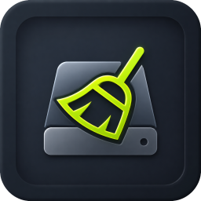
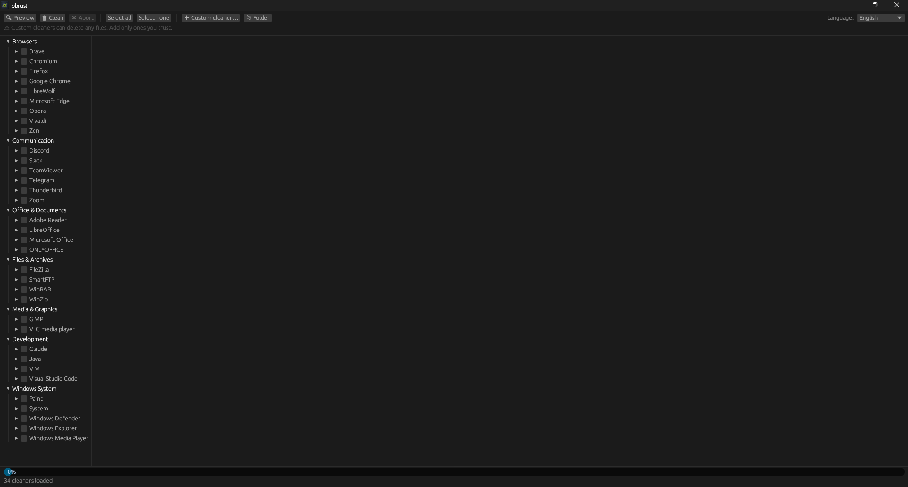
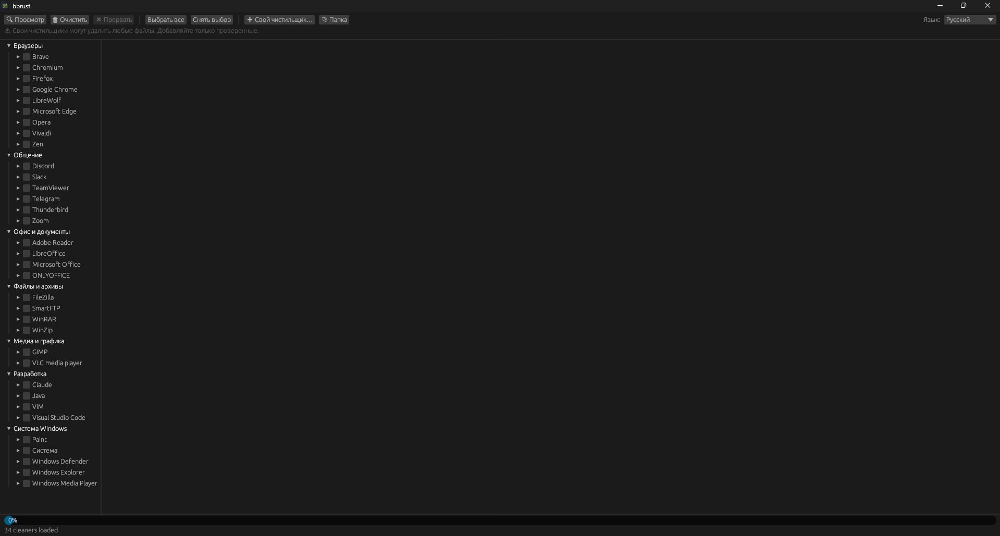

<div align="center">

# bbrust

**[English](#english) · [Русский](#русский)**



</div>

## English

A fast, lightweight **Windows** disk cleaner — a Rust rewrite of [BleachBit](https://www.bleachbit.org).

bbrust frees disk space by clearing caches, temporary files, logs and other junk from the apps
you use. It ships as a **single ~2.5 MB executable** with no installer and no external
dependencies.

> **Why a rewrite?** The original BleachBit (Python + GTK) runs its cleaning on the UI thread, so
> the window freezes during long operations. bbrust runs all cleaning on a background thread and
> streams progress to the UI — **the interface never freezes**. It's also a fraction of the size:
> a single 2.5 MB `.exe` versus ~45 MB of DLLs and a bundled Python/GTK runtime.

## Screenshot



## Features

- **Never freezes** — cleaning runs off the UI thread.
- **Tiny & portable** — one self-contained `.exe`, no install, no DLLs.
- **Preview before deleting** — see exactly what (and how much) would be removed.
- **Organized by category** — Browsers, Communication, Office, Files, Media, Development, System.
- **Per-app and per-option checkboxes** — tick a whole app or pick individual items.
- **English / Русский** UI, including translated cleaner names.
- **Remembers your settings** — language and selections persist between runs.
- **Custom cleaners** — add your own cleanup rules through the UI.
- **CLI mode** — script it with `--list` / `--preview` / `--clean`.

## Download & run

Grab `bbrust.exe` from the [Releases](../../releases) page (or build it yourself, below) and just
run it — no installation required.

> ⚠️ A disk cleaner permanently deletes files. Use **Preview** first, and double-check your
> selection before clicking **Clean**.

## Usage

### Graphical app

Launch `bbrust.exe` with no arguments. Tick the apps or individual items you want to clean, then:

- **Preview** — a dry run that shows what would be deleted and how much space you'd recover.
- **Clean** — actually delete (asks for confirmation).
- **Abort** — stop a running operation at any time.

The left panel groups cleaners by category. Each app has its own checkbox that selects all of its
options at once; the language switch (English / Русский) is in the top-right.

### Command line

```
bbrust --list                      list all cleaners and their options
bbrust --preview <cleaner.option>  show what would be deleted (dry run)
bbrust --clean   <cleaner.option>  delete for real
bbrust --cleaners-dir <path>       use a different cleaners directory
```

Example: `bbrust --preview google_chrome.cache firefox.cache`

## Custom cleaners

Cleaners are plain XML files (BleachBit's **CleanerML** format). The built-in set is **embedded in
the executable**, so the app is fully self-contained — no `cleaners` folder needs to ship alongside
it. To add your own, click **➕ Custom cleaner…** in the app and pick an `.xml` file — it's validated
and copied into `%APPDATA%\bbrust\cleaners\`, which is loaded in addition to (and can override) the
built-in cleaners. **📁 Folder** opens that directory.

A minimal cleaner looks like this:

```xml
<cleaner id="myapp">
  <label>My App</label>
  <description>Example application</description>
  <option id="cache">
    <label>Cache</label>
    <description>Delete the cache</description>
    <action command="delete" search="walk.all" path="%APPDATA%\MyApp\cache"/>
  </option>
</cleaner>
```

> Custom cleaners can delete any files they point at — only add ones you trust.

## What's different from BleachBit

bbrust is a focused, Windows-only rewrite in Rust. The advantages over the original:

- **The UI never freezes.** Cleaning runs on a background thread and streams progress to the UI over
  a channel. BleachBit runs cleaning on the GTK main thread, so it hangs while working.
- **A single small `.exe`** (~2.5 MB) with no Python runtime, no GTK, and no DLLs to install or ship.
- **Fast startup** — no interpreter or large framework to load.
- **Curated, relevant cleaner list** — only mainstream, still-maintained Windows apps; the ~40
  Linux/Unix entries that never applied on Windows are gone.
- **Extensible** — the built-in cleaners are embedded in the exe, and you can drop your own CleanerML
  `.xml` files into `%APPDATA%\bbrust\cleaners\` to add or override them, no rebuild needed.

To stay small and safe, a few things are left out:

- **Browser history cleaning** (`chrome.*` / `mozilla.*` / cookies) is omitted — it needs fragile,
  version-specific database surgery and risks deleting bookmarks. Browser **cache** cleaning still
  works via normal file deletion.
- Also dropped: document shredding decoys, Winapp2.ini import, deep scan, auto-update, and all
  Linux/Unix support.

## Building from source

Requires the Rust toolchain. On Windows without Visual Studio, use the GNU toolchain (it links with
MinGW `gcc`):

```sh
rustup default stable-x86_64-pc-windows-gnu
cargo build --release
```

For the smallest binary, compress the result with [UPX](https://upx.github.io/):
`upx --best target/release/bbrust.exe`.

Run the tests with `cargo test`.

## Credits & license

bbrust is a fork of [BleachBit](https://www.bleachbit.org) by Andrew Ziem and contributors, and
reuses its CleanerML cleaner definitions and Russian translations.

Licensed under the **GNU GPL v3 or later** (GPL-3.0-or-later), the same as BleachBit. See
[COPYING](../BleachBit-SourceCode/COPYING).

---

## Русский

Быстрый и лёгкий очиститель диска для **Windows** — переписанный на Rust [BleachBit](https://www.bleachbit.org).

bbrust освобождает место на диске, удаляя кэши, временные файлы, логи и прочий мусор используемых
вами приложений. Поставляется **одним файлом `.exe` (~2.5 МБ)** — без установщика и без внешних
зависимостей.

> **Зачем переписывать?** Оригинальный BleachBit (Python + GTK) выполняет очистку в потоке
> интерфейса, поэтому окно зависает во время долгих операций. bbrust выполняет всю очистку в фоновом
> потоке и передаёт прогресс в интерфейс — **окно никогда не зависает**. И он во много раз меньше:
> один `.exe` на 2.5 МБ против ~45 МБ DLL и встроенной среды Python/GTK.

### Снимок экрана



### Возможности

- **Не зависает** — очистка идёт вне потока интерфейса.
- **Компактный и портативный** — один самодостаточный `.exe`, без установки и DLL.
- **Предпросмотр перед удалением** — видно, что именно (и сколько) будет удалено.
- **Группировка по категориям** — браузеры, общение, офис, файлы, медиа, разработка, система.
- **Флажки по приложению и по пункту** — можно отметить целое приложение или отдельные элементы.
- **Интерфейс English / Русский**, включая переведённые названия чистильщиков.
- **Запоминает настройки** — язык и выбор сохраняются между запусками.
- **Свои чистильщики** — добавляйте собственные правила очистки через интерфейс.
- **Режим командной строки** — `--list` / `--preview` / `--clean`.

### Загрузка и запуск

Скачайте `bbrust.exe` со страницы [Releases](../../releases) (или соберите сами, см. ниже) и просто
запустите — установка не требуется.

> ⚠️ Очиститель диска удаляет файлы безвозвратно. Сначала используйте **Предпросмотр** и проверяйте
> выбор перед нажатием **Очистить**.

### Использование

#### Графическое приложение

Запустите `bbrust.exe` без аргументов. Отметьте приложения или отдельные пункты, затем:

- **Предпросмотр** — пробный прогон: показывает, что будет удалено и сколько места освободится.
- **Очистить** — реальное удаление (с подтверждением).
- **Прервать** — остановить выполняемую операцию в любой момент.

Левая панель группирует чистильщики по категориям. У каждого приложения есть свой флажок, выбирающий
сразу все его пункты; переключатель языка (English / Русский) — в правом верхнем углу.

#### Командная строка

```
bbrust --list                      список всех чистильщиков и их пунктов
bbrust --preview <cleaner.option>  показать, что будет удалено (пробный прогон)
bbrust --clean   <cleaner.option>  удалить по-настоящему
bbrust --cleaners-dir <path>       использовать другой каталог чистильщиков
```

Пример: `bbrust --preview google_chrome.cache firefox.cache`

### Свои чистильщики

Чистильщики — это обычные XML-файлы (формат **CleanerML** от BleachBit). Встроенный набор **зашит
в исполняемый файл**, поэтому приложение полностью самодостаточно — папку `cleaners` рядом класть не
нужно. Чтобы добавить свой, нажмите **➕ Свой чистильщик…** в приложении и выберите `.xml` — он будет
проверен и скопирован в `%APPDATA%\bbrust\cleaners\`, который загружается дополнительно к встроенным
(и может их переопределять). **📁 Папка** открывает этот каталог.

> Свои чистильщики могут удалить любые файлы, на которые указывают, — добавляйте только проверенные.

### Чем отличается от BleachBit

bbrust — сфокусированный переписанный под Windows вариант на Rust. Преимущества перед оригиналом:

- **Интерфейс никогда не зависает.** Очистка идёт в фоновом потоке и передаёт прогресс через канал.
  BleachBit выполняет очистку в главном потоке GTK и подвисает во время работы.
- **Один маленький `.exe`** (~2.5 МБ) без среды Python, без GTK и без DLL.
- **Быстрый запуск** — нет интерпретатора и тяжёлого фреймворка.
- **Выверенный список чистильщиков** — только актуальные Windows-приложения; ~40 Linux/Unix-записей,
  не применимых на Windows, удалены.
- **Расширяемость** — встроенные чистильщики зашиты в exe, а свои `.xml` можно класть в
  `%APPDATA%\bbrust\cleaners\` для добавления или переопределения, без пересборки.

Ради компактности и безопасности кое-что не вошло:

- **Очистка истории браузеров** (`chrome.*` / `mozilla.*` / cookies) исключена — она требует хрупких
  операций с базами, зависящих от версии, и рискует удалить закладки. Очистка **кэша** браузеров
  работает обычным удалением файлов.
- Также убрано: маскирующее затирание документов, импорт Winapp2.ini, глубокое сканирование,
  автообновление и вся поддержка Linux/Unix.

### Сборка из исходников

Нужен Rust-тулчейн. На Windows без Visual Studio используйте GNU-тулчейн (линковка через MinGW `gcc`):

```sh
rustup default stable-x86_64-pc-windows-gnu
cargo build --release
```

Для минимального размера сожмите результат через [UPX](https://upx.github.io/):
`upx --best target/release/bbrust.exe`.

Тесты запускаются командой `cargo test`.

### Благодарности и лицензия

bbrust — форк [BleachBit](https://www.bleachbit.org) Эндрю Зима (Andrew Ziem) и контрибьюторов,
повторно использующий его определения чистильщиков CleanerML и русские переводы.

Распространяется под **GNU GPL v3 или новее** (GPL-3.0-or-later), как и BleachBit. См.
[COPYING](../BleachBit-SourceCode/COPYING).